# Cividian Site Diligence Agent: architecture and contracts

Status: implementation contract for the Nebius x NVIDIA Global AI Hackathon
entry (track: Best Apps and Agents). Written 2026-09-19 against origin/main
`22c3fed`; updated 2026-09-22 for the zoning reader, the auditor and the
judging-period credit status (PRs #112, #114, #115). Everything below
describes code in this branch; sections marked "planned" are not yet
implemented.

## Product promise

Understand what the evidence supports, what remains uncertain, and what to
investigate next before advancing a development site. Decision support only:
never a determination of legal entitlement, zoning compliance, investment
suitability, engineering feasibility, or financial performance.

## The journey (one vertical slice)

| Step | Where | What happens |
| --- | --- | --- |
| A. City and site | `diligence.html`, `POST /api/diligence?action=site` | Address or map point resolves to a site identity: city, state, county, WGS84 point, and a parcel candidate from the provider chain. A bare city name is a `city_centroid` and is refused for site work. |
| B. Objective | client | One of `residential_infill`, `mixed_use`, `adaptive_reuse`, with editable labeled assumptions. |
| C. Evidence | `?action=evidence` | City ACS read, county market gaps, parcel record, zoning provider status, and the site identity itself become `evidence.record.v1` rows. Missing sources become `unavailable` rows with the reason. |
| C2. Zoning | `?action=zoning` | The Census Geocoder picks the jurisdiction; Tavily finds the adopted ordinance on official hosts; a Nemotron reader quotes districts, uses and dimensional standards; only verbatim, hash-checked quotes become `unverified` evidence rows. |
| D. Inspect | client evidence panel | Facts, assumptions, conflicts, and unknowns with scope, vintage, retrieval time, status, and source link. |
| E. Scenarios | `?action=evidence` (same run) | Deterministic capacity and screening for the chosen objective, reusing the Studio finance engine (`studio.screening.v1`). Unknown inputs stay null. |
| F. Reasoning | `?action=reason` | Nemotron on Nebius Token Factory receives a bounded packet and returns strict JSON. Every citation is validated against packet ids. Fixture mode is explicit and never runs on a production-like host. |
| G. Brief | client, `?action=export&format=html` | Ten-section decision brief plus a prioritized investigation plan. |
| H. Save and revisit | `?action=list`, `?action=get`, `?action=export` | Saved per session owner. Guests get a 24 hour session-scoped save; accounts get durable saves. |
| I. Refresh | `?action=refresh` | Re-gathers evidence for the saved site and reports per-record change classes. Manual only; there is no scheduler. |

## Modules

```
lib/diligence/
  objectives.js     objectives, assumption defaults, question library, required evidence sets
  site.js           site identity resolution and validation (geocode, county, parcel containment)
  evidence.js       evidence.record.v1 builders and the gather step (city, county gaps, parcel, zoning)
  zoning.js         ordinance read: jurisdiction, official-source discovery, reader, verbatim quote verification
  tavily.js         Tavily Search and Extract over fetch (server-held key, bounded, no redirects)
  credit.js         credit and ledger status, live-call pause, the plain paused banner
  audit.js          entailment auditor: a second model checks each accepted finding against its cited rows
  scenarios.js      deterministic scenario engine over the Studio finance runtime; sensitivity; readiness
  packet.js         bounded, id-addressed packet for the model; untrusted text is data
  schema.js         diligence.reasoning.v1 JSON schema, validator, citation and scope checks
  nebius.js         Nebius Token Factory adapter (OpenAI-compatible wire, json_schema output)
  budget.js         atomic dollar reservation, cumulative/daily/per-run caps, expiry, concurrency
  fixture.js        deterministic fixture reasoning, labeled, refused on production-like hosts
  brief.js          orchestrator: run stages, assemble diligence.brief.v1, save and load
  diff.js           brief-to-brief evidence change classification
  render.js         self-contained HTML export of a brief (print to PDF)
api/diligence.js    HTTP surface (session-gated, same-origin, rate limited)
diligence.html      the workspace (root HTML is the source of truth; build.mjs minifies to public/)
test/diligence/     node:test suites, fixtures, evaluation set and runner
```

The provider abstraction in `lib/ai.js` gains a `nebius` entry so `/api/ai-status`
reports it. The diligence path uses its own bounded transport in
`lib/diligence/nebius.js` because it needs `response_format: json_schema`,
streaming size limits, model-id verification, and a priced budget, none of which
the general `complete()` path carries. `lib/ai.js`'s paid-AI gate is unchanged.

## Contracts

### diligence.site.v1

```json
{
  "schema": "diligence.site.v1",
  "query": "300 N High St, Muncie, IN",
  "kind": "address | point | city_centroid",
  "city": "Muncie", "state": "IN", "stateName": "Indiana",
  "county": { "fips": "18035", "name": "Delaware County", "source": "FCC Area API", "retrievedAt": "ISO" },
  "point": { "lat": 40.19628, "lon": -85.387806, "source": "osm | user", "precision": "address | user_point | city" },
  "geocode": { "place": "…", "source": "osm", "retrievedAt": "ISO" },
  "parcel": {
    "status": "verified_containing | selected_candidate | address_matched | nearest_candidate | unavailable | no_coverage | no_key",
    "index": 0, "provider": "indianamap", "source": "Delaware County via IndianaMap",
    "address": "…", "geometry": { "type": "Polygon", "coordinates": [] },
    "lotSqft": 9860, "use": "Class 610", "zoningCode": null, "bldgSqft": null, "yearBuilt": null,
    "retrievedAt": "ISO", "note": "Boundary is provider geometry, not a survey. Ownership is not asserted."
  },
  "candidates": [ { "index": 0, "address": "…", "use": "…", "lotSqft": 9860, "containsPoint": true, "distanceM": 0 } ],
  "warnings": ["…"]
}
```

Rules: a `city_centroid` never becomes a site. A point never proves a parcel.
`verified_containing` means the provider polygon contains the point; it does not
mean ownership, boundary accuracy, or buildability. `address_matched` means no
polygon contained the geocoded point and the parcel whose recorded address
shares the query's house number and street was chosen; its rows are
`unverified` until the user confirms it. `nearest_candidate` is the weakest
match and is never used as a verified lot area.

### evidence.record.v1

```json
{
  "id": "ev_city_population_1851876",
  "kind": "source_observed | deterministic_calculation | user_assumption | model_interpretation | proposed_action",
  "key": "population", "fact": "Population", "value": 65194, "units": "people", "text": "Population: 65,194.",
  "source": { "name": "US Census ACS 5-year 2023", "url": "https://api.census.gov/…", "authority": "federal_statistical", "type": "api_json" },
  "scope": { "level": "city | county | parcel | point | site", "geoid": "1851876", "parcelId": null, "label": "Muncie, IN (place)" },
  "applicability": "context | site",
  "retrievedAt": "ISO", "publishedAt": null, "vintage": "2023 ACS 5-year", "freshness": "historical_vintage | current | unknown",
  "extraction": "api_json | gis_query | user_entry | formula | model_output",
  "extractionVersion": "acs.v1",
  "status": "available | unavailable | stale | conflicting | unverified",
  "coverage": "…", "excerpt": null, "hash": "sha256 hex or null",
  "note": "…"
}
```

City-level rows carry `applicability: "context"`; only parcel, point, and site
rows carry `applicability: "site"`. The model packet and the UI both keep the
distinction, and a finding's scope is the narrowest scope among its citations.
Missing values are `null` with `status: "unavailable"`; never zero.

### scenario.v1

Deterministic outputs over labeled inputs. Inputs cite either an evidence id
(`basis: "source_observed"`) or an assumption id (`basis: "user_assumption"` or
`"default_assumption"`). Finance uses the Studio engine (`studio.screening.v1`):
a known cost subtotal is never a total development cost, yield on cost is null
until the cost basis is complete, and unknown values never become zero.

Readiness categories with published criteria:

| Category | Criteria |
| --- | --- |
| `not_screenable` | no lot area from a parcel record or user entry |
| `incomplete` | geometry computed; finance outputs null because one or more cost or income inputs are unknown |
| `screenable` | every deterministic output computed from labeled inputs; still assumptions, not verified figures |

Sensitivity: each scenario recomputes under hard cost ±20%, rent ±20%, floors ±1
and reports which outputs move and whether readiness changes.

### diligence.reasoning.v1 (model output, strict)

```json
{
  "executive_assessment": "≤ 900 chars",
  "supported_findings": [ { "statement": "…", "evidence_ids": ["ev_…"] } ],
  "scenario_comparison": [ { "scenario_id": "scn_…", "fit": "stronger | weaker | comparable | not_assessable", "rationale": "…", "evidence_ids": [], "assumption_ids": [] } ],
  "decisive_unknowns": [ { "unknown_id": "unk_… or null", "statement": "…", "impact": "high | medium | low", "why": "…" } ],
  "conflicts": [ { "statement": "…", "evidence_ids": [] } ],
  "investigation_plan": [ { "question_id": "q_…", "priority": 1, "impact": "high | medium | low", "verification_method": "…", "rationale": "…" } ],
  "assumption_sensitivity": [ { "assumption_id": "as_…", "effect": "…", "direction": "increases_risk | decreases_risk | unclear" } ],
  "limitations": [ "…" ]
}
```

Validation (all must pass or the reasoning is rejected and the brief ships as
`deterministic_only` with the rejection reasons):

1. JSON parses and matches the schema (types, enums, lengths, array caps).
2. Every `evidence_ids`, `scenario_id`, `question_id`, `assumption_id`, and
   non-null `unknown_id` resolves to a packet id. Unknown ids reject the output.
3. Every supported finding cites at least one `available` record.
4. Numbers in a finding or rationale must appear in a cited record's value or
   text, or in a cited scenario's outputs. Uncited numbers reject the item.
5. No URLs, no markup, no control characters in any string.
6. The model never emits a pursue, watch, or pass determination; the schema has
   no such field and any string containing one of those tokens as a verdict is
   rejected.

### diligence.brief.v1

The saved object: `site`, `objective`, `assumptions`, `evidence`, `scenarios`,
`unknowns`, `conflicts`, `baselinePlan` (rules-based, always present),
`reasoning` (validated model output or null, with `basis` of
`model_interpretation` or `fixture`), `sections` (the ten rendered sections),
`run` (stages with real timings, provider, requested and returned model,
request id, usage, dated cost estimate, packet hash, evidence hash, limits),
and `changes` (after a refresh). `owner` is `{ kind: "account" | "guest" }`;
no email or session id leaves the server.

## Three NVIDIA models, three jobs

```mermaid
flowchart LR
  A["Site, objective,<br/>assumptions"] --> B["Evidence and scenarios<br/>(deterministic)"]
  B --> Z1["Census Geocoder:<br/>city or county"]
  Z1 --> Z2["Tavily Search and Extract:<br/>official ordinance text"]
  Z2 --> R["Nemotron 3.5 Lightning<br/>READS the ordinance"]
  R --> V1["Verbatim quote check<br/>(deterministic)"]
  V1 -->|"unverified zoning rows"| P["Bounded evidence packet"]
  B --> P
  P --> S["Nemotron 3 Super<br/>REASONS over the packet"]
  S --> V2["Schema, citation and<br/>number validator (deterministic)"]
  V2 --> AU["Nemotron 3 Nano 30B<br/>AUDITS each finding"]
  AU -->|"removes or flags only"| BR["Brief and<br/>investigation plan"]
```



Each model has one job and every model step is followed or preceded by a
deterministic check. The reader's quotes must be verbatim in the fetched text.
Super's answer must cite packet ids and cited numbers. The auditor sees each
accepted finding with only its cited rows and says whether the rows entail it:
`not_supported` removes the finding (`not_entailed`), `partially_supported`
keeps it with the unsupported words struck (they must be exact substrings of
the statement), `supported` keeps it. The auditor cannot add a finding, a
citation or a number. If it cannot run (fixture mode, price not verified,
budget refused, credit paused, provider failure) every finding carries
`audit_unavailable`; the brief is never silently unaudited. Verdict counts,
the auditor's model id and its cost estimate are recorded in
`reasoning.audit` and shown in the transparency panel and the export. All
three calls are priced per model and reserved in the one shared ledger.

## Zoning ordinance reader

Zoning is the first question in site diligence, and before this stage every
brief said "zoning unavailable". The zoning stage reads the adopted ordinance
itself:

| Step | What happens | Failure is |
| --- | --- | --- |
| Jurisdiction | Census Geocoder (current TIGER): inside an incorporated place means city or town zoning, outside means county zoning. | `jurisdiction_undetermined`, and the read stops |
| Discovery | Tavily Search with `include_domains` limited to official hosts. Each URL is checked again: https, allowed host, the state path segment on code hosts that file by state, and the jurisdiction's name in the path or title. At most 5 results, 4 documents. | `no_official_sources` |
| Retrieval | Tavily Extract text, capped per document and in total; a PDF is fetched once and hashed (8 MB cap, streamed, refused past the cap). Images are skipped. | `extract_failed`, `document_too_large`, `image_input_unsupported` |
| Reading | `DILIGENCE_READER_MODEL` (default Nemotron 3.5 Lightning) gets a bounded packet; document text is data. Strict JSON: districts, permitted uses, conditional uses, dimensional standards, each with quote, doc_id, section. Priced and reserved in the shared ledger. | `reader_failed`, `budget_refused`, `paused` |
| Verification | Keep an item only if its quote is verbatim (whitespace normalized) in the fetched text, its own fields sit inside the quote, and it is not near instruction-like text. | per item: `quote_not_found`, `field_not_in_quote`, `instruction_like_text`, `instruction_adjacent`, `unknown_document`, `quote_length` |

Kept items become `evidence.record.v1` rows: `kind: "source_observed"`,
`extraction: "model_output"`, `status: "unverified"`, jurisdiction scope
(context, never a parcel fact), the source URL, the fetched text's sha256, and
the quote as `excerpt`. The UI labels them "Read from the ordinance, confirm
with the planning office." When a district was read, the first zoning plan item
becomes "Confirm the district for parcel X with planning" and cites the
section. Tavily is metered in its own credits, counted per brief and on the
ledger record.

Model choice, recorded 2026-09-22: the handoff planned Nemotron 3 Nano Omni as
a document and image reader. Nebius removed `nvidia/Nemotron-3-Nano-Omni` from
Token Factory on 2026-08-31, and no NVIDIA model in the current catalog
accepts image input. The reader is therefore text-only. It defaults to
Nemotron 3.5 Lightning, which the deprecation notice names as Omni's
replacement and which has a 1M-token context for long ordinances. Nano 30B
stays available for the auditor, so each job keeps its own model.

## Nemotron on Nebius

| Item | Value | Verified |
| --- | --- | --- |
| Endpoint | per model region: us-central1 `https://api.tokenfactory.us-central1.nebius.com/v1/chat/completions` (Super, Ultra); eu-north1 `https://api.tokenfactory.nebius.com/v1/chat/completions` (Nano 30B, Lightning) | Super: signed-in setup code, 2026-09-20; regions: public catalog and app region map, 2026-09-22 |
| Auth | `Authorization: Bearer $NEBIUS_API_KEY` | same |
| Default model | `nvidia/nemotron-3-super-120b-a12b` | Nebius Nemotron page (code sample), Mastra and OpenRouter catalogs, 2026-09-19 |
| Other catalog ids | `nvidia/NVIDIA-Nemotron-3-Nano-30B-A3B`, `nvidia/Nemotron-3_5-Lightning`, `nvidia/Nemotron-3-Ultra-550b-a55b` | public catalog JSON, 2026-09-22 |
| Removed | `nvidia/Llama-3_1-Nemotron-Ultra-253B-v1`; `nvidia/Nemotron-3-Nano-Omni` (2026-08-31, refused by id in code). No NVIDIA model in the catalog accepts image input. | Nebius deprecation notice; catalog, 2026-09-22 |
| Structured output | `response_format: { type: "json_schema", json_schema: {...} }`, schema also in prompt | Nebius JSON docs |
| Rate limits | 429 with `Retry-After`; `x-ratelimit-remaining-*` headers | Nebius rate limit docs |
| Pricing (estimate basis) | Super $0.30 in / $0.90 out per 1M; Nano 30B $0.06 / $0.24; Lightning $0.06 / $0.24; Ultra $1 / $3. A model without a verified price is refused by the budget (`price_unverified`). | Super: signed-in price table 2026-09-20; all: public catalog JSON 2026-09-22 (VERIFICATION_RECEIPTS section 21) |

The model id must start with `nvidia/`; the demo path refuses any other id and
never falls back to a different provider. The adapter records provider,
requested and returned model, Nebius request id, latency, reported usage, and a
cost estimate labeled with the pricing date and source.

## Live inference gate

All of the following, or the run is `deterministic_only` with an explicit
`inference: unavailable` reason:

- `NEBIUS_API_KEY` present, `NEBIUS_MODEL` matching `^nvidia/`
- `DILIGENCE_LIVE_INFERENCE=1`
- `AI_BUDGET_APPROVAL_REFERENCE` and `AI_APPROVED_BUDGET_USD > 0`
- `DILIGENCE_DAILY_BUDGET_USD` at or below the approved ceiling
- a budget store: Redis on any production-like host (fails closed without it),
  in-process memory only for local runs

Guests may trigger live inference only when `DILIGENCE_GUEST_INFERENCE=1`
(judging). Fixture mode is `DILIGENCE_FIXTURE_MODE=1` and is refused when the
host is production-like.

## Safety and limits

- Session required (guest or account). Anonymous callers get 401.
- POST requires same origin. Rate limits per IP and per action.
- Input caps: query 200 chars, assumptions bounded and validated, packet 24 KB,
  model output 24 KB, up to 3000 output tokens, 20 s provider timeout, one
  bounded retry on 429 or 5xx honoring Retry-After within the deadline.
- Concurrency cap on live runs, daily and per-run dollar caps.
- Logs redact credentials (`lib/log.js`) and never carry the packet body.
- Third-party text (parcel addresses, provider notes, source excerpts) is data
  inside the packet, never instructions. The validator rejects outputs that
  add facts, ids, numbers, links, or verdicts.

### Live completion tuning, 2026-09-20

The first actual Super request reached the 1,400-token ceiling and returned
`finish_reason: length`; it was rejected without accepting partial JSON.
The bounded task now requests concise final JSON with a 3,000-token ceiling
and uses `chat_template_kwargs: {enable_thinking: false}` for Super only.
The evidence validator, 20-second deadline, two-attempt reservation, and
spending limits are unchanged. NVIDIA documents this generation control at
https://huggingface.co/nvidia/NVIDIA-Nemotron-3-Super-120B-A12B-FP8 .
Nebius accepts extra request properties in its chat-completion API schema:
https://docs.tokenfactory.nebius.com/api-reference/inference/create-chat-completion .
Hosted acceptance passed with these settings: 4,362 input tokens, 708 output
tokens, 3,910 ms and finish_reason=stop. All 12 journey checks passed.

## Integrated release safeguards, September 22

See [release hardening](RELEASE_HARDENING_20260922.md) for the separate atomic Tavily allowance, pinned public-source fetching, strict auditor validation and whole-batch benchmark preflight. Live activation and local fixture evidence remain separate.
